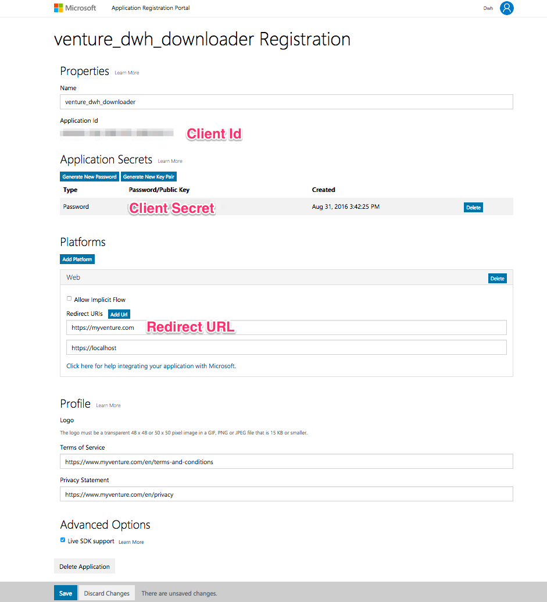
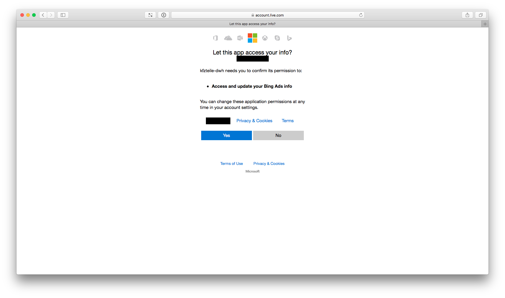

# BingAds Performance Downloader

A Python script for downloading performance and keyword data from the [BingAds API version 12](https://docs.microsoft.com/en-us/bingads/guides/?view=bingads-12) to local files. The code is largely based on [Bing Ads Python SDK](https://github.com/BingAds/BingAds-Python-SDK).

The [mara Bing ads performance pipeline](https://github.com/mara/bing-ads-performance-pipeline) can be, then, used for loading and transforming the downloaded data into a dimensional schema.

## Resulting data

**BingAds Performance Downloader** gives measures such as impressions, clicks and cost. The script creates three csv files per day in a specified time range, for example:

    /tmp/bingads/2016/05/03/bing/ad_performance.csv.gz
    /tmp/bingads/2016/05/03/bing/keyword_performance.csv.gz
    /tmp/bingads/2016/05/03/bing/campaign_performance.csv.gz

 Each line of `keyword_performance` contains one ad for one day:

    TimePeriod           | 2/12/2016
    AccountId            | 17837800573
    AccountName          | Online Veiling Gent
    CampaignId           | 254776453
    CampaignName         | Veiling Gent
    AdGroupId            | 3508678047
    AdGroupName          | BE_NL_GEN_Auction_City_{e}
    AdId                 | 9011292478
    Keyword              | Veiling
    KeywordId            | 2271053633
    Device type          | Tablet
    BiddedMatchType      | Phrase
    Clicks               | 0
    Impressions          | 5
    Ctr                  | 0.00
    AverageCpc           | 0.00
    Spend                | 0.00
    QualityScore         | 8
    Conversions          | 0
    Revenue              | 0
    Network              | Bing and Yahoo! search

While `ad_performance` has these columns:

    AccountName          | Name
    AccountNumber        | X001342
    AccountId            | 67688
    TimePeriod           | 2018-02-03
    CampaignName         | 12. Campaign name
    CampaignId           | 1234567
    AdGroupName          | Name of the group group
    AdId                 | 8123456789
    AdGroupId            | 123456789011
    AdTitle              | title of the ad, optional
    AdDescription        | Description of the ad
    AdType               | Expanded text ad
    Impressions          | 2
    Clicks               | 3
    Ctr                  | 45.78%
    Spend                | 4.34
    AveragePosition      | 1.00
    Conversions          | 12
    ConversionRate       | 23.8%
    CostPerConversion    | 2.34
    DeviceType           | Computer
    AccountStatus        | Active
    CampaignStatus       | Active
    AdGroupStatus        | Active
    AdLabels             | {label1=value1};{label2=value2}

And `Campaign performance` is:

    AccountName          | Name of the account
    AccountId            | 123456
    TimePeriod           | 2018-01-10
    CampaignName         | 1. Banner 03
    CampaignId           | 1234567
    Spend                | 1.23
    CampaignLabel        | {channel=display}

Additionally one account structure file is generated for example:

    /tmp/bing/bing-account-structure.csv.gz

which contains `Account Structure` as:

    AdId                | 101123456
    AdTitle             | your_ad_name
    AdGroupId           | 123456789011
    AdGroupName         | your_ad_group_name
    CampaignId          | 1234567
    CampaignName        | your_campaign_name
    AccountId           | 12345678
    AccountName         | your_company_us
    Attributes          | {channel=display}

## Getting Started

### Installation

 The Bing AdWords Performance Downloader requires:

    Python (>= 3.6)
    bingads (automatically installed by setup.py)
    click (automatically installed by setup.py)

The easiest way to install bing-adwords-downloader is using pip

    pip install git+https://github.com/mara/bingads-performance-downloader.git

If you want to install it in a virtual environment:

    $ git clone git@github.com:mara/bingads-performance-downloader.git bingads_downloader
    $ cd bingads_downloader
    $ python3 -m venv venv
    $ venv/bin/pip install .

### Set up your OAuth2 credentials

Getting access to the Bing Ads Account:

Ask your SEM manager to invite you to the Bing Ads Account of the company. The role should be Super Admin. Once you receive the confirmation e-mail
(may take up to 2 hours), you should click on the link and create a Microsoft account.

Getting **developer token**:
Go to this page [https://developers.bingads.microsoft.com/Account](https://developers.bingads.microsoft.com/Account), you will find your developer-token. You have to be logged in with your Microsoft account.

Getting **oauth client id** and **oauth client secret** :
Go to this page [https://apps.dev.microsoft.com](https://apps.dev.microsoft.com/). You have to be logged in with your Microsoft account. Set a **Native-Application** and allow **built-in redirect URIs**.

Follow these steps:

    Copy the Application Id, it will be the 'oauth-client-id' ()
    Copy now the field 'Password/Public key' as 'oauth-client-secret' ()
    Copy now the redirect URI as 'oauth-client-redirect-uri' ()

In order to access the BingAds API you have to obtain the OAuth2 credentials from BingAds.

    $ refresh-bingsads-api-oauth2-token \
    --developer_token ABCDEFEGHIJKL \
    --oauth2_client_id 123456789 \

This will open a web browser to allow the OAuth2 credentials to access the API on your behalf.

**Copy the url from the browser** as instructed in the commandline. Paste it into the command line where you are running
`refresh-bingsads-api-oauth2-token` and press enter.

The script should complete and display an offline **refresh token** on the command line. Keep this refresh token for the download step.

## Usage

To run the BingAds Performance Downloader call `download-bingsads-performance-data` with its config:

    $ download-bingsads-performance-data \
    --developer_token ABCDEFEGHIJKL \
    --oauth2_client_id 123456789 \
    --oauth2_client_secret aBcDeFg \
    --oauth2_refresh_token MCQL58pByMOdq*sU7 \
    --data_dir /tmp/bingads

For all options, see the _help_

    $ download-bingsads-performance-data --help
    Usage: download-bingsads-performance-data [OPTIONS]

      Downloads data. When options are not specified, then the defaults from
      config.py are used.

    Options:

      --developer_token TEXT          The developer token that is used to access
                                      the BingAds API. Default: "012345679ABCDEF"
      --oauth2_client_id TEXT         The Oauth client id obtained from the
                                      BingAds developer center. Default:
                                      "abc1234-1234-1234-abc-abcd1234"
      --oauth2_client_secret TEXT     The Oauth client secret obtained from the
                                      BingAds developer center. Default:
                                      "ABCDefgh!1234567890"
      --oauth2_refresh_token TEXT     The Oauth refresh token returned from the
                                      adwords-downloader-refresh-oauth2-token
                                      script. Default: "ABCDefgh!1234567890ABCDefg
                                      h!1234567890ABCDefgh!1234567890ABCDefgh!1234
                                      567890ABCDefgh!1234567890ABCDefgh!1234567890
                                      ABCDefgh!1234567890"
      --data_dir TEXT                 The directory where result data is written
                                      to. Default: "/tmp/bingads/"
      --output_file_version TEXT      A suffix that is added to output files,
                                      denoting a version of the data format.
                                      Default: "v2"
      --first_date TEXT               The first day from which on data will be
                                      downloaded. Default: "2015-01-01"
      --environment TEXT              The deployment environment. Default:
                                      "production"
      --timeout TEXT                  The maximum amount of time (in milliseconds)
                                      that you want to wait for the report
                                      download. Default: "3600000"
      --total_attempts_for_single_day TEXT
                                      The attempts to download a single day (ad
                                      and keyword performance) in case of HTTP
                                      errors or timeouts. Default: "5"
      --retry_timeout_interval TEXT   number of seconds to wait before trying
                                      again to download a single day. Default:
                                      "10"
      --help                          Show this message and exit.
